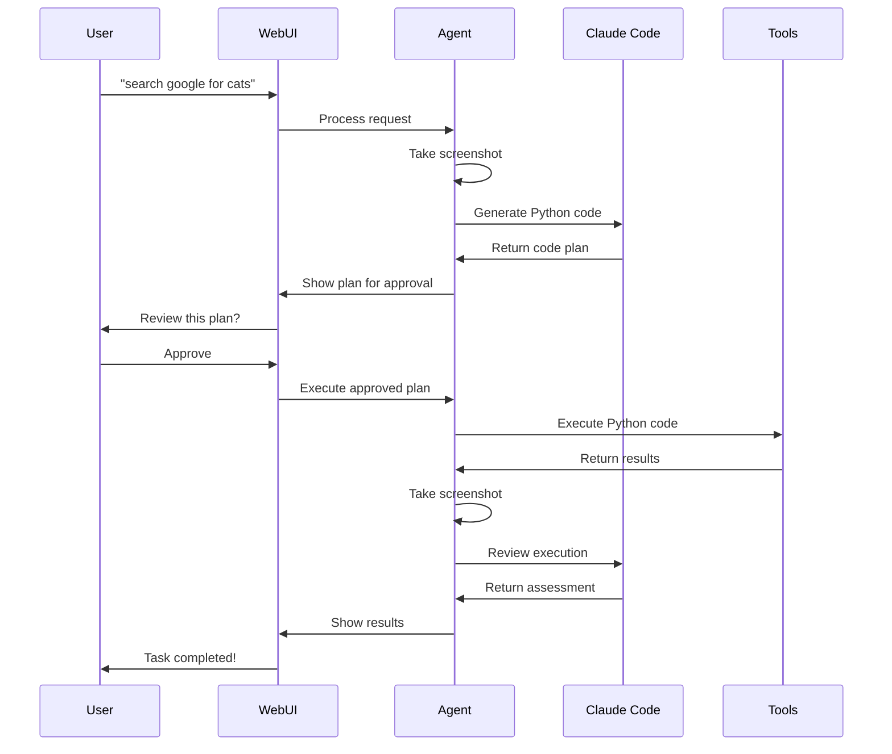

# Claude Code Agent - Quick Start Guide

## 🚀 What is it?

The Claude Code Agent is an intelligent automation system that:

1. **Takes screenshots** of your current screen
2. **Generates Python code** using Claude Code to accomplish tasks
3. **Executes the code** using your existing kyros.tools
4. **Reviews results** with Claude Code for feedback
5. **Provides a web interface** for easy interaction

## ⚡ Quick Start

### 1. Install Dependencies
```bash
pip install -r requirements_claude_agent.txt
```

### 2. Run Tests (Optional)
```bash
python run_tests.py
```

### 3. Start the Web Interface
```bash
python start_claude_agent.py --mode web
```

Open your browser to: **http://localhost:8000**

### 4. Try Some Examples

In the web interface, try these requests:

- `take a screenshot`
- `search google for restaurants near me`
- `open a new browser tab`
- `focus on chrome window`
- `type 'hello world' and press enter`

## 🎯 How It Works



## 🌐 Web Interface Features

- **Real-time chat interface** for natural language requests
- **Plan review system** - approve before execution
- **Live execution feedback** with progress updates
- **Screenshot comparison** - before/after views
- **Claude Code reviews** of execution results
- **WebSocket communication** for instant updates

## 🔧 Alternative Usage Modes

### CLI Mode (No Web Interface)
```bash
python start_claude_agent.py --mode standalone
```

### Test with Mock Agent (No Claude Code Required)
```bash
python test_web_server.py
```

### Direct API Usage
```python
from claude_code_agent import ClaudeCodeAgent

agent = ClaudeCodeAgent()
result = agent.process_user_request("take a screenshot")
print(f"Success: {result['execution']['success']}")
```

## 🛠 Configuration

### Custom Claude Code Path
```python
agent = ClaudeCodeAgent(claude_code_path="/path/to/claude")
```

### Custom Web Server Settings
```bash
python start_claude_agent.py --mode web --host 0.0.0.0 --port 8080
```

### Skip Dependency Checks
```bash
python start_claude_agent.py --skip-checks
```

## 📁 File Structure

```
├── claude_code_agent.py       # Main agent implementation
├── claude_code_web_server.py   # Web interface server
├── start_claude_agent.py       # Startup script
├── test_simple_agent.py        # Mock agent for testing
├── test_web_server.py          # Test web server
├── run_tests.py                # Comprehensive test suite
├── demo_claude_agent.py        # Basic demo
├── requirements_claude_agent.txt # Python dependencies
└── screenshots/                # Screenshot storage
```

## 🧪 Testing

### Quick Test
```bash
python demo_claude_agent.py
```

### Full Test Suite
```bash
python run_tests.py
```

### Test Web Interface
```bash
python test_web_server.py
# Open browser to http://localhost:8000
```

## 🔍 Troubleshooting

### Common Issues

**"Claude Code CLI not found"**
```bash
# Install Claude Code CLI first
curl -sSL https://install.claude.ai | bash
claude --version
```

**"No module named kyros"**
- This is handled automatically in the latest version
- If you see this, update to the latest code

**"Permission denied" on screenshots**
- Ensure your display manager allows screenshot access
- Try running with appropriate permissions

**Web interface not loading**
- Check if port 8000 is available
- Try a different port: `--port 8080`
- Check firewall settings

### Debug Mode
```bash
python start_claude_agent.py --mode standalone --skip-checks
```

## 🎉 Success!

If you see this message after running tests:
```
🎉 All tests passed! Claude Code Agent is ready to use.
```

You're ready to start automating tasks with natural language!

## 📚 Examples Gallery

### Web Browsing
- "search google for python tutorials"
- "navigate to github.com"
- "bookmark this page"
- "scroll down to see more content"

### Application Control
- "open calculator and calculate 15 * 23"
- "open file manager and navigate to Downloads"
- "take a screenshot of the current window"
- "switch to the next application"

### Text Operations
- "type my email address"
- "copy the selected text"
- "paste and press enter"
- "select all text and delete it"

### System Operations
- "check the current time"
- "open system settings"
- "adjust volume to 50%"
- "lock the screen"

Happy automating! 🤖✨